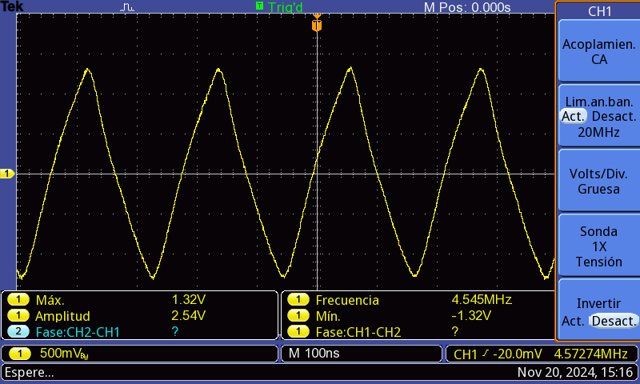
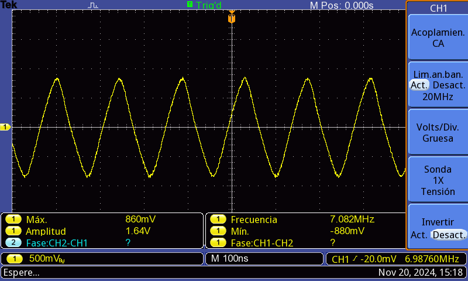

# Desarrollo de laboratorio 1
## Parte 1: Comparar las especificaciones técnicas de cada dispositivo
# Comparación: Negador TTL 74LS04 vs Negador CMOS CD4069

A continuación, se muestra una tabla con las principales diferencias técnicas:

| Característica                         | 74LS04 (TTL)                                            | CD4069 (CMOS)                                          |
|----------------------------------------|---------------------------------------------------------|--------------------------------------------------------|
| **Tecnología de fabricación**          | TTL (Transistor-Transistor Logic)                       | CMOS (Complementary Metal-Oxide-Semiconductor)         |
| **Voltaje de operación (Vcc)**         | 4.75V a 5.25V                                           | 3V a 15V                                               |
| **Consumo de corriente**               | Mayor consumo de energía debido a la tecnología TTL     | Menor consumo de energía gracias a la tecnología CMOS  |
| **Tiempo de propagación**              | Aproximadamente 10 ns                                   | Aproximadamente 50 ns                                  |
| **Margen de ruido**                    | Menor margen de ruido                                   | Mayor inmunidad al ruido                               |
| **Capacidad de corriente de salida**   | Puede hundir hasta 8 mA y suministrar 0.4 mA              | Puede hundir o suministrar hasta 4 mA                  |
| **Rango de temperatura de operación**  | 0°C a 70°C                                              | -55°C a 125°C                                          |

## Parte 2: Circuitos equivalentes de cada negador en TTL y CMOS

