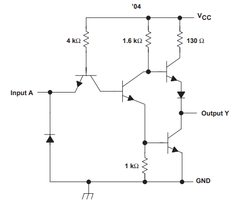
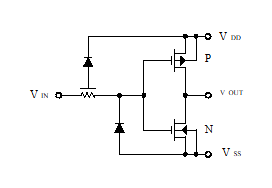
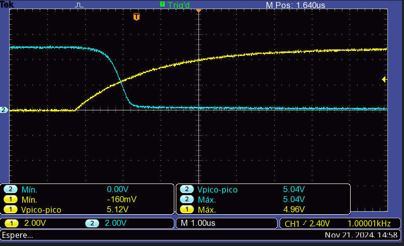
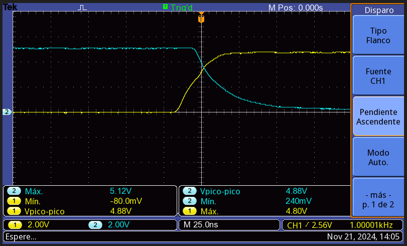
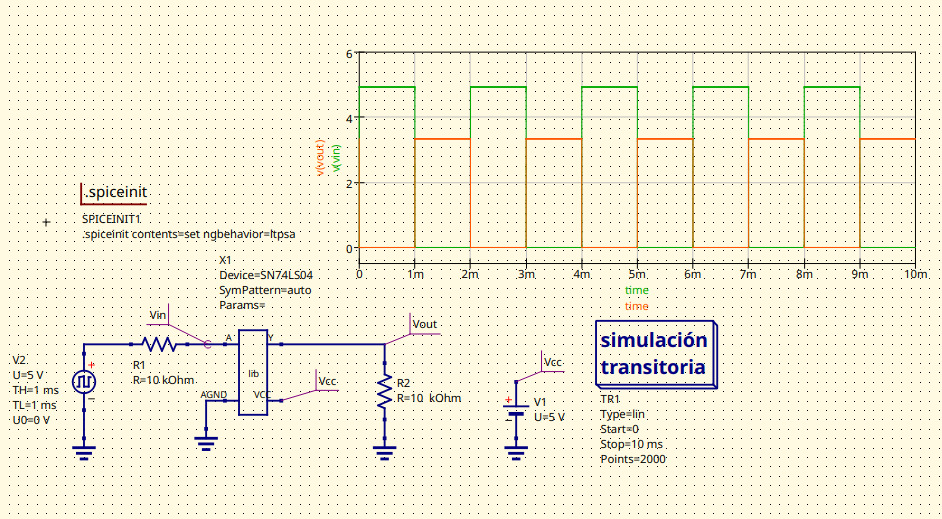
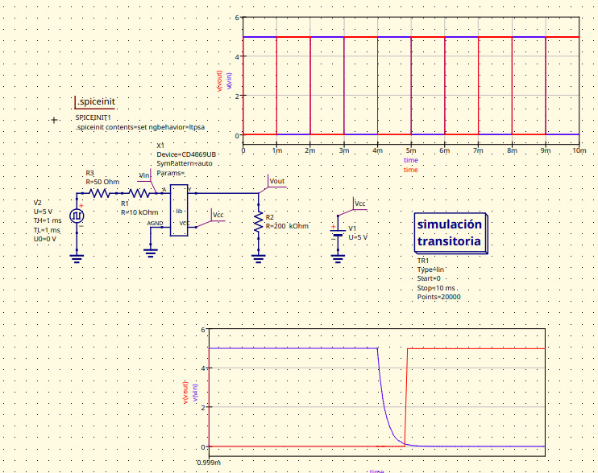
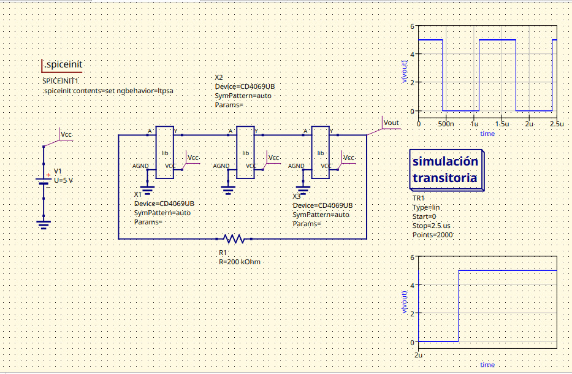
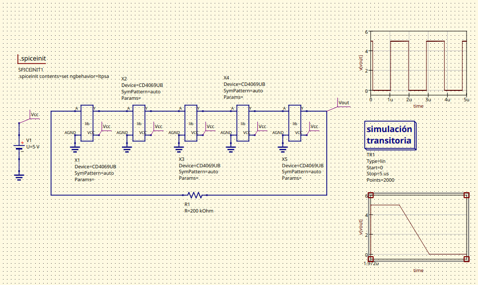

# Desarrollo de laboratorio 1
## Parte 1: Comparar las especificaciones técnicas de cada dispositivo

### Circuitos equivalentes de cada negador en TTL y CMOS
 - TTL

 - CMOS
   

# Comparación: Negador TTL 74LS04 vs Negador CMOS CD4069

A continuación, se muestra una tabla con las principales diferencias técnicas:

| Característica                         | 74LS04 (TTL)                                            | CD4069 (CMOS)                                          |
|----------------------------------------|---------------------------------------------------------|--------------------------------------------------------|
| **Tecnología de fabricación**          | TTL (Transistor-Transistor Logic)                       | CMOS (Complementary Metal-Oxide-Semiconductor)         |
| **Voltaje de operación (Vcc)**         | 4.75V a 5.25V                                           | 3V a 15V                                               |
| **Consumo de corriente**               | Mayor consumo de energía debido a la tecnología TTL     | Menor consumo de energía gracias a la tecnología CMOS  |
| **Tiempo de propagación**              | Aproximadamente 10 ns                                   | Aproximadamente 50 ns                                  |
| **Margen de ruido**                    | Menor margen de ruido                                   | Mayor inmunidad al ruido                               |
| **Capacidad de corriente de salida**   | Puede hundir hasta 8 mA y suministrar 0.4 mA              | Puede hundir o suministrar hasta 4 mA                  |
| **Rango de temperatura de operación**  | 0°C a 70°C                                              | -55°C a 125°C                                          |

### Gráficas en el osciloscopio
A continuación se muestran las gráficas obtenidas en el osciloscopio del oscilador de anillos para el TTL y el CMOS.
- TTL

 - CMOS
   

Nótese cómo los tiempos del CMOS son menores que el TTL, coincidiendo satisfactoriamente con la teoría. 
### Gráficas y circuito en la simulación
- TTL

 - CMOS
   

### Comparación de Datos Experimentales Vs. Teóricos

| Parámetro                      | Experimental (TTL)  | Teórico (TTL)   | Diferencia           | Experimental (CMOS) | Teórico (CMOS)      | Diferencia         |
|--------------------------------|---------------------|-----------------|----------------------|---------------------|---------------------|--------------------|
| tPLH (Low → High)              | 13 ns              | 10 - 20 ns      | Dentro del rango     | 100 ns              | 50 - 200 ns         | Dentro del rango   |
| tPHL (High → Low)              | 19 ns              | 10 - 20 ns      | Dentro del rango     | 120 ns              | 50 - 200 ns         | Dentro del rango   |
| tr (Tiempo de subida)          | 22.8 ns            | < 25 ns         | Dentro del rango     | 5.36 µs             | 100 ns - µs         | En el rango alto   |
| tf (Tiempo de bajada)          | 26 ns              | < 25 ns         | Ligeramente alto     | 6.48 µs             | 100 ns - µs         | En el rango alto   |
| Tiempo de propagación (out)    | 49 ns (TPLH) 39 ns (TPHL) | No especificado | N/A                  | 780 ns (TPLH) 940 ns (TPHL) | No especificado | N/A                |
| talm (Tiempo de alineación)    | 12 ns              | No disponible   | N/A                  | 840 ns              | No disponible       | N/A                |
| VIL (Voltaje Bajo de Entrada)  | 2.08 V             | 0.8 V           | Mayor de lo esperado | 1.67 V              | 1/3 VDD (≈1.67 V a 5V) | Dentro del rango   |
| VIH (Voltaje Alto de Entrada)  | 3.47 V             | 2 V             | Mayor de lo esperado | 2.72 V              | 2/3 VDD (≈3.33 V a 5V) | Lig. menor         |

## Parte 2:

### Fan-in 
No fue posible medirlo en el laboratorio. 

### Fan-out
Las compuertas TTL requieren una corriente de entrada alta. En el laboratorio se obtuvo una salida de aproximadamente 7 mA máximo. Debido a la resolución del dispositivo, no se pudo realizar una medición precisa del dispositivo. Teniendo en cuenta que la corriente de entrada del dispositivo es varían entre 20 uA y 0.4 mA, se obtiene un Fan-out de 17.5.

Las compertas CMOS tienen una salida de aproximadamente 2 mA en estado alto. Por la resolución del multímetro, no fue posible medir la corriente de entrada del CMOS, por tanto, el Fan-out del dipositivo no se pudo determinar. Pero asumiendo que la corriente está en el orden de los nanoamperios, el Fan Out es muy grande. 

### Potencia de disipación. 
- TTL
Asumiendo un voltaje de 5V y una corriente de consumo de 0.4mA y 20uA, se deduce que la potencia de un disipación de la compuerta oscila entre 2mW y  0.1 mW al alternar entre estado alto y bajo.

- CMOS
Asumiendo un voltaje de 5V y una corriente de salida de 2 mA, la potencia disipada es 10 mW en estado alto.  

## Parte 3: 
El oscilador en anillo es un circuito compuesto por compiertas NOT que se utiliza para generar señales una señal peródica sin necesidad de componentes externos.
En esencia, este oscilador se forma conectando en serie un número impar de compuertas inversoras (NOT), de modo que la saliada de la última compuerta se retroalimente a la entrada de la primera. Por el funcinamiento intrínseco de la compuerta NOT, esta empezará oscilar. Se necesita un número impar de inversores para que la señal no se estabilice, y cambie continuamente de estado. La frecuencia se determina utilizando el retardo de propagación de cada compuerta, sumándose entre sí conforme se agregan más compuertas. 
### Graficas de salida del anillo
- Oscilador con CMOS: 7MHz

- Osclilador con TTL: 4MHz

### Graficas y circuito de simulacion

**Comparación:** En ambos circuitos se muestra una forma de onda que es rectangular, y no coincide con lo planteado en las simulaciones; sin embargo, cómo es de esperarse, los tiempos de propagación de las compuertas CMOS son menores, y por tanto, la frecuencia en la que oscila el anillo es 3 MHz mayor que la TTL. 
