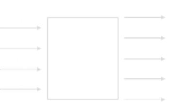
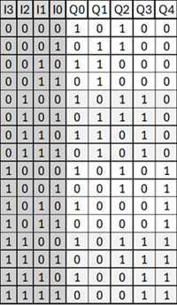
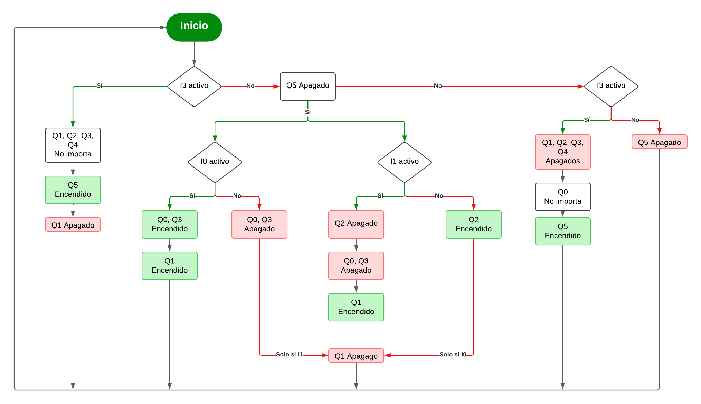
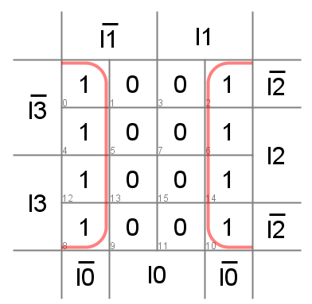
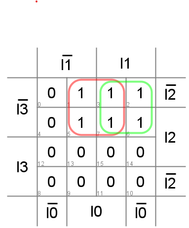
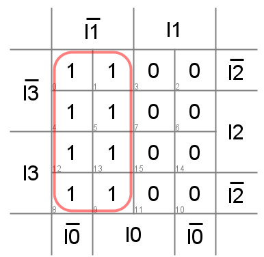
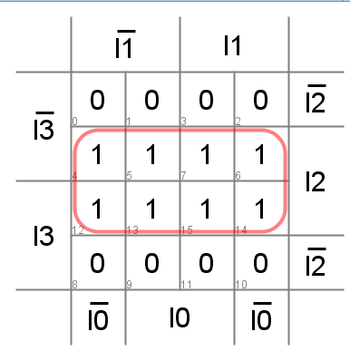
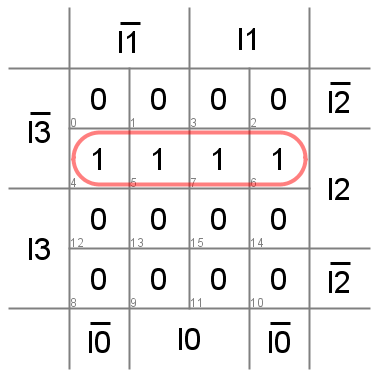
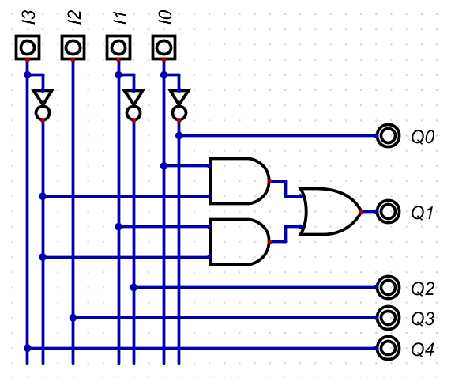
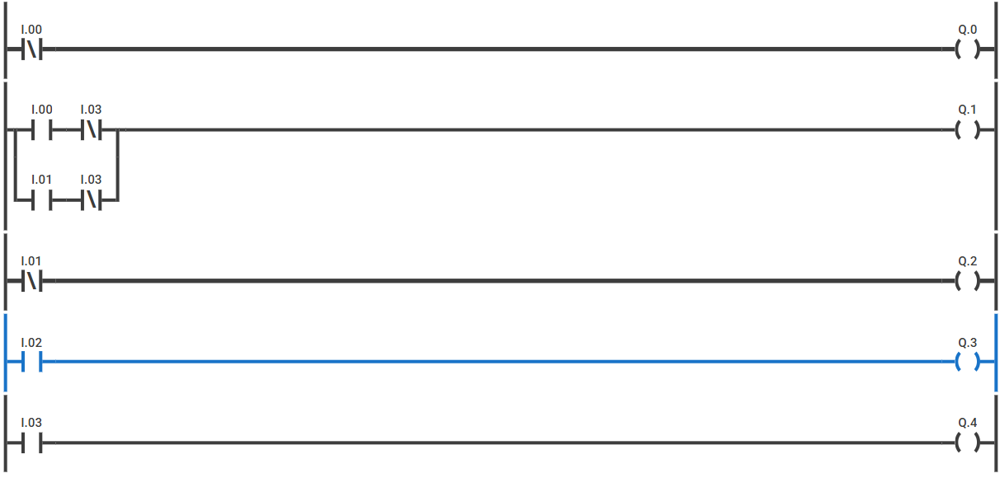

# Mi primer diseño 
## 1. **Dominio Comportamental (Especificación y Algoritmo)**
Se plantea inicilamente el comportamiento esperado por el sistema, se utiliza como medio el diagrama de caja Negra, en el que se representan las entradas y salidas de infomación. En esta situación problema se plantean las siguientas entradas y salidas:

* **$I_0$** = Red eléctrica (Sensor de fuente 1)

* **$I_1$** = Banco de baterías (Sensor de fuente 2)

* **$I_2$** = Energía solar (Sensor de Luz)

* **$I_3$** = Botón de paro de emergencia

* **$Q_0$** = Relé de conmutación entre fuentes

* **$Q_1$** = Relé para energizar o desenergizar

* **$Q_2$** = Indicador cuando las baterías están descargadas

* **$Q_3$** = Indicador de suficiente radiación solar

* **$Q_4$** = Desenergización de la casa para mantenimiento

Como siguiente paso, se propone la tabla de verdad considerando todos los posibles casos, en este punto hacemos uso de la condición Don't Care y de las siguientes condiciones(facilitan la construcción de la tabla de verdad dadas las definiciones de los parametros):

* **$I_0$**  
  * 0 = No hay red  
  * 1 = Hay red  

* **$I_1$**  
  * 0 = Batería descargada  
  * 1 = Batería cargada  

* **$I_2$**  
  * 0 = No hay energía solar  
  * 1 = Hay energía solar  

* **$I_3$**  
  * 0 = No está activo  
  * 1 = Está activo  

* **$Q_0$**  
  * 0 = Conmutación a red eléctrica  
  * 1 = Conmutación al banco de baterías  

* **$Q_1$**  
  * 0 = Casa energizada  
  * 1 = Casa desenergizada  

* **$Q_2$**  
  * 0 = Batería descargada  
  * 1 = Batería cargada  

* **$Q_3$**  
  * 0 = Hay suficiente energía solar  
  * 1 = No hay suficiente energía solar  

* **$Q_4$**  
  * 0 = Está en paro de emergencia  
  * 1 = No está en paro de emergencia

Como último paso, para el dominio comportamental se plantea un diagrame de flujo para representar de manera gráfica y secuencial el algoritmo de la solución que se planteó.

## **2. Dominio físico y estructural**

La información contenida en la [tabla de verdad](./TablaV.png) se consignó y sintentizó en Digital con el fin de crear el circuito eléctrico equivalente en una combinación de compuertas lógicas AND y OR. 

### **Ecuaciones de salida y Mapas de Karnaugh**
Para cada una de las salidas, las ecuaciones que describen su comportamiento en cada uno de los posibles casos son: 
* **$Q_0$** (Relé conmutador) = $\overline{I_0 }$
  * Mapa de Karnaugh:
  
  
 
* **$Q_1$** (Relé energizar la casa) = $(I_0 \wedge \overline{I_3})\ \vee \ (I_1 \wedge \overline{I_3})$
   * Mapa de Karnaugh:
  
  
 
* **$Q_2$** (LED Sensor de batería) = $\overline{I_1}$
   * Mapa de Karnaugh:
  
  
 
* **$Q_3$** (LED Sensor energía solar) = $(I_0 \wedge I_1 \wedge \overline{I_3}) \vee \ I_2 $
   * Mapa de Karnaugh:
  
  
 
* **$Q_4$** (LED Paro de emergencia) = $I_3$
  * Mapa de Karnaugh:
  
  

La siguiente figura muestra el diagrama [esquemático](./Lab2.dig) del circuito eléctrico: 

 

## **3. Simulación de Ladder**
Utilizando la herramienta de simulación online plcsimulator, se llevó a cabo la síntesis del circuito eléctrico en lenguaje Ladder. Se separaron las líneas de alimentación en función de los actuadores (Q), y se reemplazaron las compuertas lógicas AND y OR con su respectivo equivalente. El circuito resultante es el siguiente: 

 

 Link: https://app.plcsimulator.online/ugBNkyt7YDsvcPpc3VFT

 ## **4. Descripción en lenguaje HDL**
 ## **5. Síntesis en FPGA**
 ## **6. Conclusiones** 
 

