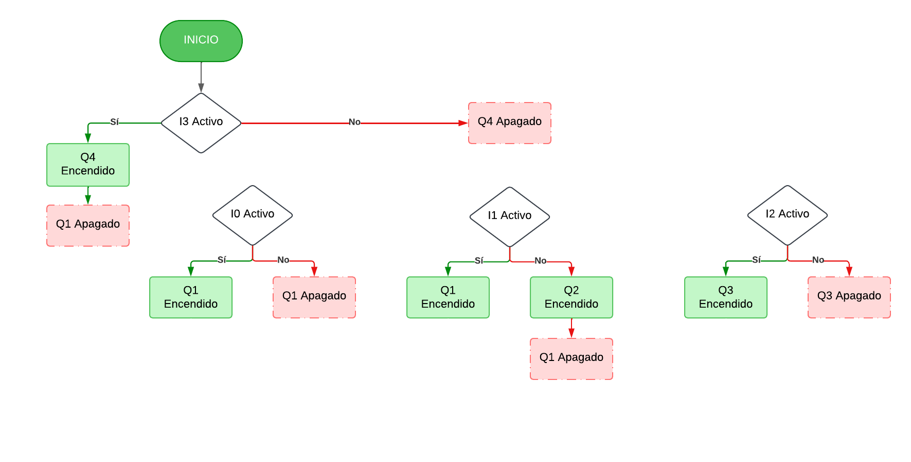
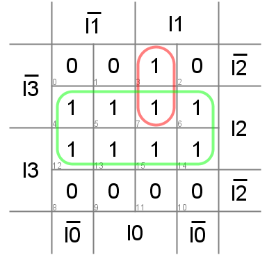

# Mi primer diseño 
## 1. **Dominio Comportamental (Especificación y Algoritmo)**
Se plantea inicilamente el comportamiento esperado por el sistema, se utiliza como medio el diagrama de caja Negra, en el que se representan las entradas y salidas de infomación. En esta situación problema se plantean las siguientas entradas y salidas:

* **$I_0$** = Red eléctrica (Sensor de fuente 1)

* **$I_1$** = Banco de baterías (Sensor de fuente 2)

* **$I_2$** = Energía solar (Sensor de Luz)

* **$I_3$** = Botón de paro de emergencia

* **$Q_0$** = Relé de conmutación entre fuentes

* **$Q_1$** = Relé para energizar o desenergizar

* **$Q_2$** = Indicador cuando las baterías están descargadas

* **$Q_3$** = Indicador de suficiente radiación solar

* **$Q_4$** = Desenergización de la casa para mantenimiento

Como siguiente paso, se propone la tabla de verdad considerando todos los posibles casos:

* **$I_0$**  
  * 0 = No hay red  
  * 1 = Hay red  

* **$I_1$**  
  * 0 = Batería descargada  
  * 1 = Batería cargada  

* **$I_2$**  
  * 0 = No hay energía solar  
  * 1 = Hay energía solar  

* **$I_3$**  
  * 0 = No está activo  
  * 1 = Está activo  

* **$Q_0$**  
  * 0 = Conmutación a red eléctrica  
  * 1 = Conmutación al banco de baterías  

* **$Q_1$**  
  * 0 = Casa energizada  
  * 1 = Casa desenergizada  

* **$Q_2$**  
  * 0 = Batería descargada  
  * 1 = Batería cargada  

* **$Q_3$**  
  * 0 = Hay suficiente energía solar  
  * 1 = No hay suficiente energía solar  

* **$Q_4$**  
  * 0 = Está en paro de emergencia  
  * 1 = No está en paro de emergencia

Como último paso, para el dominio comportamental se plantea un diagrame de flujo para representar de manera gráfica y secuencial el algoritmo de la solución que se planteó.

## **2. Dominio físico y estructural**

La información contenida en la [tabla de verdad](./TablaV.png) se consignó y sintentizó en Digital con el fin de crear el circuito eléctrico equivalente en una combinación de compuertas lógicas AND y OR. 

### **Ecuaciones de salida y Mapas de Karnaugh**
Para cada una de las salidas, las ecuaciones que describen su comportamiento en cada uno de los posibles casos son: 
* **$Q_0$** (Relé conmutador) = $\overline{I_0 }$
  * Mapa de Karnaugh:
  
  
 
* **$Q_1$** (Relé energizar la casa) = $(I_0 \wedge \overline{I_3})\ \vee \ (I_1 \wedge \overline{I_3})$
   * Mapa de Karnaugh:
  
  
 
* **$Q_2$** (LED Sensor de batería) = $\overline{I_1}$
   * Mapa de Karnaugh:
  
  
 
* **$Q_3$** (LED Sensor energía solar) = $(I_0 \wedge I_1 \wedge \overline{I_3}) \vee \ I_2 $
   * Mapa de Karnaugh:
  
  
 
* **$Q_4$** (LED Paro de emergencia) = $I_3$
  * Mapa de Karnaugh:
  
  

La siguiente figura muestra el diagrama [esquemático](./Lab2Digital.dig) del circuito eléctrico: 

 

## **3. Simulación de Ladder**
Utilizando la herramienta de simulación online plcsimulator, se llevó a cabo la síntesis del circuito eléctrico en lenguaje Ladder. Se separaron las líneas de alimentación en función de los actuadores (Q), y se reemplazaron las compuertas lógicas AND y OR con su respectivo equivalente. El circuito resultante es el siguiente: 

 

 Link: https://app.plcsimulator.online/ugBNkyt7YDsvcPpc3VFT

 ## **4. Descripción en lenguaje HDL**
 
 module top (
  
  input I3,
  
  input I2,
  
  input I1,
  
  input I0,
  
  output Q0,
  
  output Q1,
  
  output Q2,
  
  output Q3,
  
  output Q4,

);

  assign Q1 = ((I0 & ~ I3) | (I1 & ~ I3));
  
  assign Q2 = ~ I1;
  
  assign Q0 = ~ I0;
  
  assign Q3 = I2;
  
  assign Q4 = I3;

endmodule

- El anterior codigo fue construido exportando un codio verilog del circuito creado en el software Digital; como se puede apreciar es un modulo que se basa en logica combinacional.
  
#### Localizacion de pines
LOCATE COMP "clk" SITE "P6";
IOBUF PORT "clk" IO_TYPE=LVCMOS33;
FREQUENCY PORT "clk" 25 MHZ;

LOCATE COMP "a" SITE "M13"; # V7.1

LOCATE COMP "I0" SITE "C4";
IOBUF PORT "I0" IO_TYPE=LVCMOS33;

LOCATE COMP "I1" SITE "D4";
IOBUF PORT "I1" IO_TYPE=LVCMOS33;

LOCATE COMP "I2" SITE "D3";
IOBUF PORT "I2" IO_TYPE=LVCMOS33;

LOCATE COMP "I3" SITE "E3";
IOBUF PORT "I3" IO_TYPE=LVCMOS33;

LOCATE COMP "Q0" SITE "G14";
IOBUF PORT "Q0" IO_TYPE=LVCMOS33;

LOCATE COMP "Q1" SITE "G13";
IOBUF PORT "Q1" IO_TYPE=LVCMOS33;

LOCATE COMP "Q2" SITE "F12";
IOBUF PORT "Q2" IO_TYPE=LVCMOS33;

LOCATE COMP "Q3" SITE "F13";
IOBUF PORT "Q3" IO_TYPE=LVCMOS33;

LOCATE COMP "Q4" SITE "F14";
IOBUF PORT "Q4" IO_TYPE=LVCMOS33;

- El anterior codigo es una descripcion que enviamos a la FPGA para ubicar en que pines van a estar las salidas y las entradas, teniendo en cuenta el mapeo de los pines de la FPGA Colorlight y que las salidas y entradas deben tener un nivel logico de 3.3 V
  
 ## **5. Síntesis en FPGA**
Para el uso de la FPGA nos ayudamos de un video introductorio del profesor Johnny con el cual pudimos entender como implementar los diferentes archivos y modulos necesarios para que la comunicación entre la FPGA y nuestro circuito fuera exitoso, para esto fue necesario apreciar principalmente los siguientes aspectos:
- La FPGA colorlight se comunica mediante un modulo CRIUS con el computador, para la implementacion de este modulo es importante identificar las conexiones de los pines Ground, VCC, CTS, TXT, RX, DTR con la FPGA, lo cual fue posible ayudandonos del comando Make-help, que permitio entender las conexiones de dichos pines.
- Despues se implemento el codigo de Verilog generado por Digital en un archivo top.v, el cual implementaba la logica necesaria para que los actuadores reaccionaran segun el comportamiento de las entradas.
- Por ultimo se realizo el mapeo de los pines y se conecto la  FPGA con el circuito.

 Nota: Es importante destacar que la FPGA color light solo permite la conexion de entradas en su primer cuadrante de pines.
 
 ## **6. Conclusiones** 

* Se logró estructurar el sistema a través de un modelo de caja negra, donde se identificaron claramente las entradas y salidas, permitiendo una mejor comprensión de la función de cada componente.
* Se estableció una lógica de control eficiente para la conmutación entre la red eléctrica, baterías y energía solar, asegurando que la casa siempre cuente con una fuente de energía disponible.
* Se redujo la complejidad del hardware sin afectar la funcionalidad, garantizando una implementación más eficiente.
* Se incorporaron indicadores visuales para el estado de las baterías y la energía solar, facilitando el monitoreo del sistema
* Se logró una correcta separación de las líneas de alimentación y control, permitiendo una mayor claridad en la programación del sistema.

