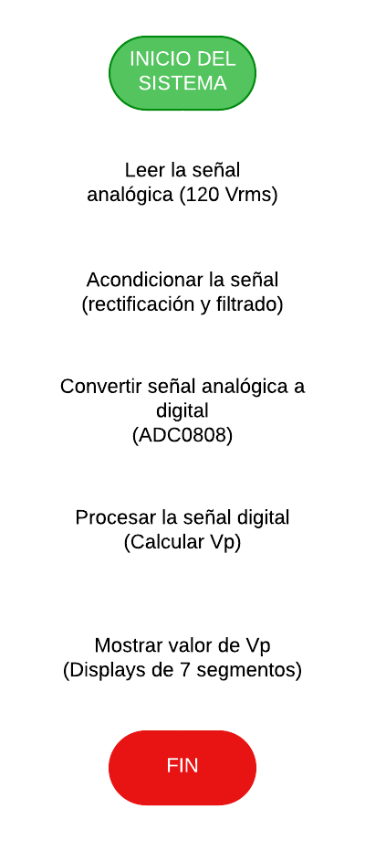
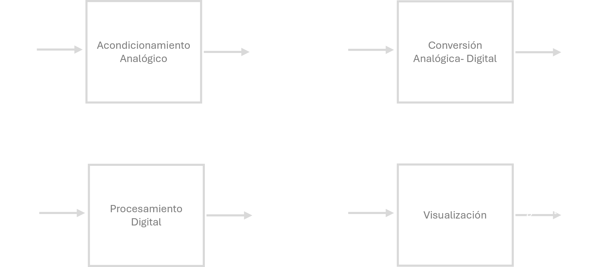
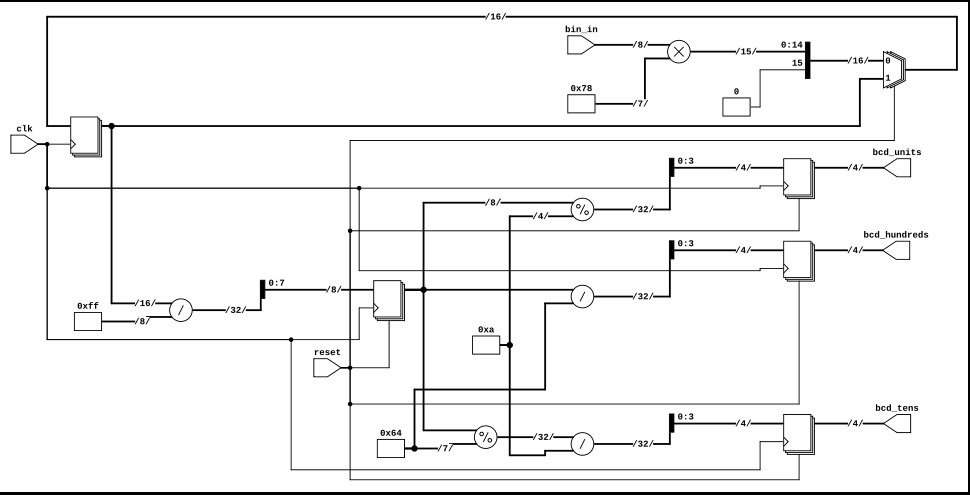
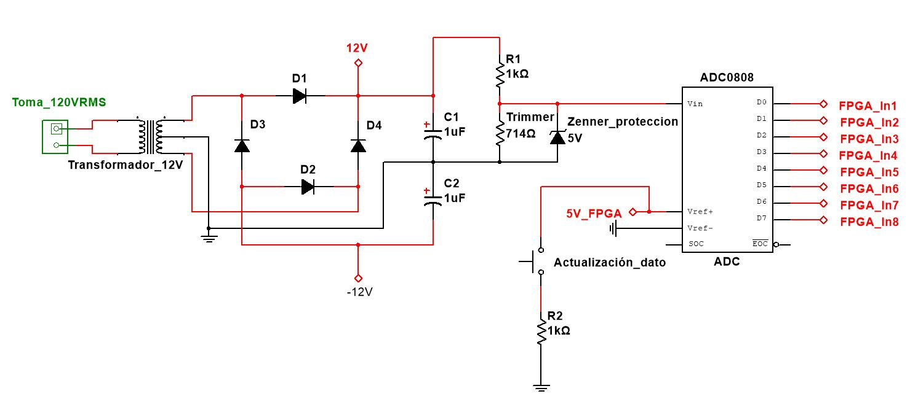
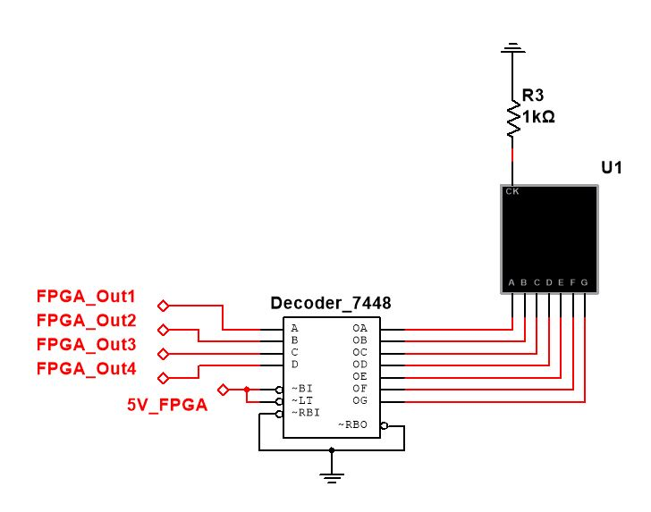
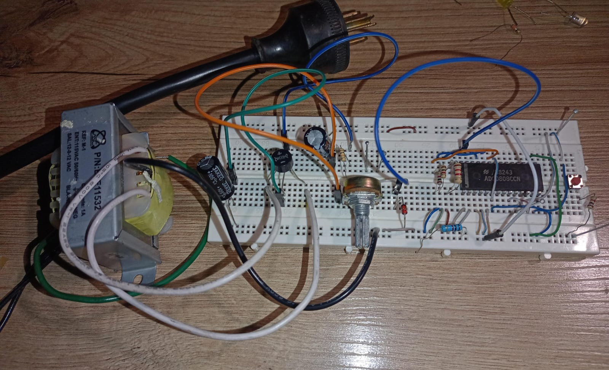
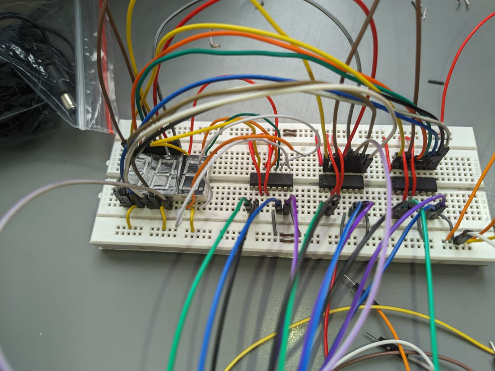

# Diseño de un voltímetro de Vp (tensión pico) para una red monofásica de 120 Vrms
## 1) **Dominio Comportamental**
### Requerimientos del Sistema

#### Requerimientos Funcionales
| Requerimiento                 | Descripción |
|--------------------------------|---------------------------------------------|
| **Medición de Tensión Pico (Vp)** | El sistema debe ser capaz de medir la tensión pico de una señal AC con un valor promedio de 120 Vrms. |
| **Conversión Analógica a Digital** | La señal analógica de entrada debe ser convertida a una señal digital para su procesamiento. |
| **Procesamiento Digital** | El sistema debe procesar la señal digital para calcular el valor de la tensión pico. |
| **Visualización** | El valor de la tensión pico debe ser mostrado en un visualizador digital, ya sea mediante displays de 7 segmentos o enviando los datos a una terminal serial. |

#### Requerimientos No Funcionales

| Requerimiento                 | Descripción |
|--------------------------------|---------------------------------------------|
| **Precisión** |  El sistema debe tener una precisión adecuada, considerando las pérdidas en el circuito analógico de acople. |
| **Velocidad de Respuesta** |  El sistema debe tener una precisión adecuada, considerando las pérdidas en el circuito analógico de acople. |
| **Seguridad** |  El sistema debe tener una precisión adecuada, considerando las pérdidas en el circuito analógico de acople. |
| **Facilidad de uso** | La interfaz de visualización debe ser clara y fácil de interpretar. |

### Entradas y salidas
1) Entradas 
* Señal analógica: Voltaje de la red eléctrica (120 Vrms)
* Clock: Necesario para el numero de veces que se actualiza el dato y frecuencia de muestreo del dispositivo

2) Salidas
* Señal digital: Datos generados por el ADC0808, representando la tensión pico.
* Visualización de datos: Display de 7 segmentos
  
### Diagrama de flujo 

## 2) Dominio Estructural
### Diagrama de caja negra

### Diseño del circuito en compuertas lógicas

### Descripción del diseño en HDL

El codigo planteado para la realización del laboratorio se encuentra adjunto en la carpeta respectiva a la práctica 3. 
- En el módulo del principio se expresa el Clock del sistema; las entradas que lee la FPGA de conversor ADC; y las salidas para cada uno de los decodificadores BCD.
- Si se desea mapear 120 VRMS en 255 (entrada binaria), se debe realizar la división entre ambos valores para deducir cuánto voltaje equivale un único bit en la entrada. Este resultado se debe multiplicar por la lectura de la FPGA en los pines de entrada _bin_in_, y así obtener obtener en la salida la medición deseada. En el caso máximo, se multiplica 255 (bits de entrada = 5V) por 120, lo que requiere un registro de 15 bits (_mult_registro_) para almacenar el número. 

Posterior al escalado, la magnitud resultante puede oscilar en un rango entre 120 y 0, por lo que se almacena en forma binaria en un registro de 7 bits, para luego ser dividido en centenas, decenas, y unidades, y ser enviado a los decodificadores BCD. Los decodificadores convierten el número obtenido a base 10, y lo muestran en tiempo real en los _display 7 segmentos_.

## 3) Dominio Fisico
### Protocolo de Ensayo y Prueba

El montaje del circuito se realizó en dos partes. Una de ellas contenía las pantllas 7 segmentos con sus respectivos decodificadores, y en la otra se encontraba el conversor ADC0808 con la salida de voltaje ajustada del transformador. A continuación se anexan los planos esquemáticos. 

- Montaje transformador y ADC

- Montaje displays y decondificadores. Se repitió este mismo circuito por cada display de 7 segmentos utilizado. 

El circuito fue montado el labortorio de acuerdo con las conexiones del diagrama esquemático. Se tuvieron en cuenta los datasheet del decodificador, los display, y el ADC para concretar todas las conexiones. A continuación se muestra el montaje. 

En la imagen se muestra un transformador con _tap_ central que reduce la tensión de 120VRMS a 12VRMS. La salidas del bobinado secundario se conectaron a un puente rectificador en paralelo con unos condensadores de 2200uF para disminuir el rizado de la señal, y así ubicar dos resistencias en serie para formar un divisor de tensión que garantice una señal de salida de 5 voltios en la salida. Cómo medida de protección, se ubicó un diodo Zener de 4.7V en paralelo a la resistencia del Trimmer (mirar esquemático) para garantizar una tensión siempre menor 5V. Midiendo con el multímetro, la salida del transformador en AC era en realidad **12.24V** (2% mayor a lo esperado), y en el voltaje en el Zenner de **4.634V** (7.32% menor a lso 5V). 

La salida de 4.7V se ubicó en una de las entradas analógicas del ADC, para ser procesada y convertida en un arreglo de 8 bits en las salidas del integrado. En la imagen se muestran resistencias de _pull up_, y un pulsador que actualiza el dato en la salida del ADC. Este se puede reeplazar por un Clock con una frecuencia que entre dentro de los rangos establecido por el fabricante en el datasheet

Los decodificadores BCD 7448 se conectaron a los displays 7 segmentos de acuerdo con el diagrama esquemático. 

El montaje completo se implementó en el labortatorio; sin embargo, al correr el código, no se logró que en la salida de mostrara la medida del voltímetro. 

##### Identificación de Errores:
- Si se detectan errores, documenta las posibles causas y las correcciones aplicadas.
- Realiza las modificaciones necesarias y repite las pruebas.

##### Informe Final:
- Prepara un informe que incluya:
  - Descripción del sistema.
  - Diagramas esquemáticos.
  - Resultados de las pruebas.
  - Conclusiones y recomendaciones.

---

#### 7. Video de Explicación (Opcional)

- Graba un video corto (máximo 5 minutos) explicando:
  - El flujo de diseño.
  - Las pruebas realizadas.
  - Los resultados obtenidos.
  - Las conclusiones finales.

---

- **Seguridad:** Siempre prioriza la seguridad al trabajar con altos voltajes. Si es posible, utiliza un transformador reductor para realizar pruebas iniciales con voltajes más bajos.
- **Iteración:** Si encuentras errores, repite las pruebas después de realizar las correcciones necesarias.
- **Documentación:** Mantén un registro detallado de todas las pruebas y resultados para facilitar la depuración y la mejora del sistema.

