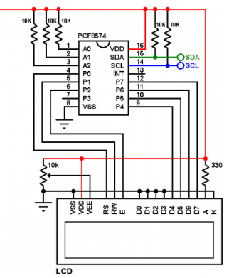

# Maquina de Estado del proyecto final

## Introducción

En el marco de los objetivos de desarrollo planteados por la Organización de las Naciones Unidas, específicamente los objetivos de hambre cero y ciudades sostenibles, planteamos como proyecto un sistema digital de automatización y monitoreo de cultivos de tomates que estén sobre terrazas de edificios en la ciudad de Bogotá, como propuesta para aportar al desarrollo de estos objetivos. Para la implementación de dicho proyecto, se creó un prototipo en el que, mediante un sensor capacitivo de humedad del suelo basado en el protocolo I2C (Soil Sensor Seesaw), se monitorea dicha variable, mostrándola en una pantalla LCD V1.4 16×2 con un módulo PCF8574 integrado, que también está basado en ese mismo protocolo; además, se usa esa información de humedad del suelo para controlar dicha variable con un sistema de riego, de manera que esta permanecería dentro de un rango establecido que favorezca el buen desarrollo del cultivo. Debido a la complejidad del sistema y la numerosa cantidad de máquinas de estado que se manejan paralelamente dentro del prototipo, en este documento nos centraremos unicamente en el flujo de diseño para implementar la pantalla LCD en nuestro sistema.

## Caracterizacion de la LCD 16x2 y el modulo PCF8574

Para iniciar la implmentación de la LCD en nuestra FPGA primero se investigaron sus condiciones de operación y su conexion con el modulo adaptador I2C PCF8574, dicha información se puede encontrar en las siguientes paginas: https://simple-circuit.com/arduino-i2c-lcd-pcf8574/ y https://www.vishay.com/docs/37484/lcd016n002bcfhet.pdf , en la primera pagina encontraremos la función de cada pin de la LCD y los comandos necesarios para realizar su secuencia de inicio, de dicha información tuvimos en cuenta lo siguiente para la implementación de nuestra LCD en la FPGA Colorlight 8.2V :

* Pines $D_7$, $D_6$, $D_5$, $D_4$ : Son los pines de datos, se usan para enviar comandos y caracteres a la pantalla en modo de 4 bits.
* Pin BL : Controla la retroiluminación de la pantalla, puede encenderse o apagarse según sea necesario.
* Pin E : Habilita la comunicación entre el microcontrolador y la pantalla, un pulso en este pin indica que los datos en los pines D4-D7 deben ser procesados.
* Pin RW : Define el modo de operación; si está en 0, la pantalla recibe datos (escritura), si está en 1, la pantalla envía datos al microcontrolador (lectura), normalmente se deja en escritura.
* Pin RS : Determina el tipo de dato enviado, si está en 0, se envía un comando (como clear display), si está en 1, se envían caracteres para ser mostrados en la LCD.
* Comando Reset : Reinicia la LCD a su estado inicial en 8 bits, se debe enviar 3 veces para incializar la pantalla, con tiempos de espera de 5ms entre el primer-segundo envio y 160us entre el segundo-tercer envio. Para escribir este comando se debe enviar a la LCD 0x03 en hexadecimal, con RS = 0 y RW = 0.
* Comando Modo 4 bits : Configura la LCD para operar en modo 4 bits, reduciendo los pines de datos. Para escribir este comando se debe enviar a la LCD 0x02 en hexadecimal, con RS = 0 y RW = 0.
* Function set : Define el modo de datos (4 u 8 bits), número de líneas y tamaño de caracteres. Para escribir este comando se debe enviar a la LCD 0x28 (4 bits, 2 líneas, 5x8) o 0x38 (8 bits, 2 líneas, 5x8), en hexadecimal, con RS = 0 y RW = 0. 
* Display off : Apaga la pantalla sin borrar la memoria de datos. Para escribir este comando se debe enviar a la LCD 0x08 en hexadecimal, con RS = 0 y RW = 0.
* Clear display: Borra la pantalla y mueve el cursor a (0,0). Para escribir este comando se debe enviar a la LCD 0x01 en hexadecimal, con RS = 0 y RW = 0.
* Entry mode set : Configura el desplazamiento del cursor y el texto. Para escribir este comando se debe enviar a la LCD 0x06 (cursor avanza a la derecha) en hexadecimal, con RS = 0 y RW = 0.
* Display on : Enciende la pantalla y puede habilitar el cursor y parpadeo. Para escribir este comando se debe enviar a la LCD 0x0C (sin cursor, sin parpadeo), 0x0E (con cursor) o 0x0F (cursor parpadeante), en hexadecimal, con RS = 0 y RW = 0.

En la segunda pagina encontraremos la forma en la que esta conectada la LCD 16x2 con el módulo adpatador I2C PCF8574, lo cual se puede observar en la siguiente imagen: 

| Pines PCF8574 | Pines LCD |
|--------------|----------|
| P7          | D7       |
| P6          | D6       |
| P5          | D5       |
| P4          | D4       |
| P3          | BL       |
| P2          | E        |
| P1          | RW       |
| P0          | RS       |

