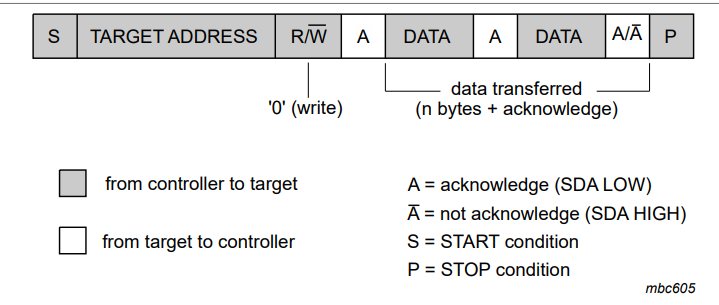

# Maquina de Estado del proyecto final

## Introducción

En el marco de los objetivos de desarrollo planteados por la Organización de las Naciones Unidas, específicamente los objetivos de hambre cero y ciudades sostenibles, planteamos como proyecto un sistema digital de automatización y monitoreo de cultivos de tomates que estén sobre terrazas de edificios en la ciudad de Bogotá, como propuesta para aportar al desarrollo de estos objetivos. Para la implementación de dicho proyecto, se creó un prototipo en el que, mediante un sensor capacitivo de humedad del suelo basado en el protocolo I2C (Soil Sensor Seesaw), se monitorea dicha variable, mostrándola en una pantalla LCD V1.4 16×2 con un módulo PCF8574 integrado, que también está basado en ese mismo protocolo; además, se usa esa información de humedad del suelo para controlar dicha variable con un sistema de riego, de manera que esta permanecería dentro de un rango establecido que favorezca el buen desarrollo del cultivo. Debido a la complejidad del sistema y la numerosa cantidad de máquinas de estado que se manejan paralelamente dentro del prototipo, en este documento nos centraremos unicamente en el flujo de diseño para implementar la pantalla LCD en nuestro sistema.

## Protocolo I2C

El protocolo I2C (Inter-Integrated Circuit) es un estándar de comunicación serie desarrollado por Philips Semiconductor (ahora NXP) que permite la interconexión de múltiples dispositivos utilizando solo dos líneas: SDA (Serial Data Line) para la transmisión de datos y SCL (Serial Clock Line) para la sincronización; es un protocolo ampliamente utilizado en sistemas embebidos, sensores, pantallas LCD y microcontroladores debido a su simplicidad y eficiencia en la comunicación entre dispositivos. I2C funciona bajo un esquema máster-esclavo, donde un dispositivo maestro controla la comunicación y los esclavos responden según su dirección única asignada, soporta velocidades de transmisión desde 100 kHz (modo estándar) hasta varios MHz en modos más avanzados; su capacidad de conectar múltiples dispositivos en el mismo bus sin requerir muchas conexiones físicas lo hace ideal para aplicaciones de bajo consumo y dispositivos integrados.

La comunicación en I2C sigue una secuencia bien definida controlada por un dispositivo maestro que inicia y gestiona la transmisión de datos hacia uno o más dispositivos esclavos. La secuencia es la siguiente:

* **Estado de reposo (IDLE)** : El bus se encuentra en reposo cuando SCL y SDA están en alto, no hay comunicación activa en el bus y los dispositivos están en espera. 
* **Condición de inicio (START)** : El maestro genera una transición de alto a bajo en SDA mientras SCL está en alto, esto indica el inicio de una comunicación.
* **Envío de dirección del esclavo (ADDRESS)** : El maestro envía una dirección de 7 bits o 10 bits (según el estándar) del esclavo con el que quiere comunicarse, se añade un bit de lectura/escritura (0 para escritura, 1 para lectura).
* **Confirmación (ACK/NACK)** : El esclavo seleccionado responde con un bit de reconocimiento (ACK) bajando la línea SDA, si no hay respuesta (NACK), la comunicación se detiene o el maestro intenta nuevamente.
* **Transmisión de datos (DATA)** : El maestro o esclavo envía datos de 8 bits, comenzando con el bit más significativo (MSB), después de cada byte el receptor envía un ACK si el dato fue recibido correctamente.
* **Condición de parada (STOP)** : El maestro genera una transición de bajo a alto en SDA mientras SCL está en alto, esto indica el final de la comunicación y el bus regresa al estado de reposo.

## Caracterizacion de la LCD 16x2 y el modulo PCF8574

Antes de implementar la LCD en nuestra FPGA, se investigaron sus condiciones de operación y su conexion con el modulo adaptador I2C PCF8574, dicha información se puede encontrar en las siguientes paginas: https://simple-circuit.com/arduino-i2c-lcd-pcf8574/ y https://www.vishay.com/docs/37484/lcd016n002bcfhet.pdf , en la primera pagina encontraremos la función de cada pin de la LCD y los comandos necesarios para realizar su secuencia de inicio, de dicha información tuvimos en cuenta lo siguiente para la implementación de nuestra LCD en la FPGA Colorlight 8.2V :

* **Pines $D_7$, $D_6$, $D_5$, $D_4$** : Son los pines de datos, se usan para enviar comandos y caracteres a la pantalla en modo de 4 bits.
* **Pin BL** : Controla la retroiluminación de la pantalla, puede encenderse o apagarse según sea necesario.
* **Pin E** : Habilita la comunicación entre el microcontrolador y la pantalla, un pulso en este pin indica que los datos en los pines D4-D7 deben ser procesados.
* **Pin RW** : Define el modo de operación; si está en 0, la pantalla recibe datos (escritura), si está en 1, la pantalla envía datos al microcontrolador (lectura), normalmente se deja en escritura.
* **Pin RS** : Determina el tipo de dato enviado, si está en 0, se envía un comando (como clear display), si está en 1, se envían caracteres para ser mostrados en la LCD.
* **Comando Reset** : Reinicia la LCD a su estado inicial en 8 bits, se debe enviar 3 veces para incializar la pantalla, con tiempos de espera de 5ms entre el primer-segundo envio y 160us entre el segundo-tercer envio. Para escribir este comando se debe enviar a la LCD 0x03 en hexadecimal, con RS = 0 y RW = 0.
* **Comando Modo 4 bits** : Configura la LCD para operar en modo 4 bits, reduciendo los pines de datos. Para escribir este comando se debe enviar a la LCD 0x02 en hexadecimal, con RS = 0 y RW = 0.
* **Function set** : Define el modo de datos (4 u 8 bits), número de líneas y tamaño de caracteres. Para escribir este comando se debe enviar a la LCD 0x28 (4 bits, 2 líneas, 5x8) o 0x38 (8 bits, 2 líneas, 5x8), en hexadecimal, con RS = 0 y RW = 0. 
* **Display off** : Apaga la pantalla sin borrar la memoria de datos. Para escribir este comando se debe enviar a la LCD 0x08 en hexadecimal, con RS = 0 y RW = 0.
* **Clear display** : Borra la pantalla y mueve el cursor a (0,0). Para escribir este comando se debe enviar a la LCD 0x01 en hexadecimal, con RS = 0 y RW = 0.
* **Entry mode set** : Configura el desplazamiento del cursor y el texto. Para escribir este comando se debe enviar a la LCD 0x06 (cursor avanza a la derecha) en hexadecimal, con RS = 0 y RW = 0.
* **Display on** : Enciende la pantalla y puede habilitar el cursor y parpadeo. Para escribir este comando se debe enviar a la LCD 0x0C (sin cursor, sin parpadeo), 0x0E (con cursor) o 0x0F (cursor parpadeante), en hexadecimal, con RS = 0 y RW = 0.

En la segunda pagina encontraremos la forma en la que esta conectada la LCD 16x2 con el módulo adpatador I2C PCF8574, lo cuál se puede observar en la siguiente imagen: 

y se puede entender mejor con la siguiente tabla, donde los pines P7-P0 representan los bits desde el mas significativo al menos significativo del byte enviado por la línea SDA.

| Pines PCF8574 | Pines LCD |
|--------------|----------|
| P7          | D7       |
| P6          | D6       |
| P5          | D5       |
| P4          | D4       |
| P3          | BL       |
| P2          | E        |
| P1          | RW       |
| P0          | RS       |

Para terminar hay que tener en cuenta que la dirección I2C de la LCD 16x2 con el modulo POF8574 integrado es 0x27 en hexadecimal.

## Implementación de la LCD en la FPGA

Para iniciar la implementación de la LCD en la FPGA Colorlight se idearon las siguientes maquinas de estado:

* **Maquina de estados para el protocolo I2C** : Dicha maquina emula el protocolo I2C antes descrito, de forma que solo se incia si otra maquina de estados que llamaremos "controlador" le envia una señal de inicio, además de generar una señal "BUSY" para indicar que la línea SDA esta ocupada realizando una operación e implementa contadores para poder escribir correctamente la direccion de 7 bits, el bit de escritura y los 8 bits de datos; por ultimo tiene en cuenta el tri-state de SDA para que el maestro suelte el bus y le de la posibilidad de responder al esclavo.
  

* **Maquina de estado del controlador** : Dicha maquina nos permite repetir la secuencia I2C las veces que queramos mientras "BUSY = 0", es decir mientras la línea SDA no este ocupada en una operación, enviando la señal de incio a la maquina de estados I2C, la dirección I2C asociada a la LCD y el dato o comando que querramos enviar, en este caso para escribir "humedad suelo %" tuvimos que hacer 101 repeticiones, cuando se sobrepase dicho número de repeticiones la secuencia I2C no se repertirá más como se puede obsevar en la maquina donde la cantidad de repeticiones esta representada por la palabra "Rep" y se finalizara la transacción de datos en el estado "FINISH". Es importante destacar que el valor o dato enviado esta asociado a un número de repetión especifico, por ende el número de datos enviados es igual al número de repetiones, en nuestro caso 101.

Finalmente para poder escribir correctamente en la LCD, se debia enviar la siguiente secuencia de inicialización: Reset, 5ms de espera, Reset, 160us de espera, Reset, Modo 4 bits, Function set, Display off, Clear display, espera de 2ms, Entry mode set, Display on; trabajamos en modo de 4 bits, ya que el modulo PCF8574 solo puede controlar 4 pines de datos de la LCD; para enviar los comandos Reset y Modo 4 bits deberemos enviar primero el comando con BL=1, E=1, RW=0, RS=0 y luego con E=0, para que la LCD los guarde; a partir de el comando Function set la lógica será similar con la diferencia de que como ya ingresamos a modo 4 bits tendremos que dividir los comandos en los 4 bits mas signficativos y los 4 menos significatvos para enviar cada uno por parte con la secuencia BL=1, E=1, RW=0, RS=0 y luego con E=0, de manera que para enviar cada comando de Functicon set en adelante se necesitará enviar 4 bytes de información; para mostrar caracteres en la LCD debemos seguir la logica de envio antes mencionada con la diferencia de que RS=1, para el envio de caracteres nos guiaremos de la siguiente tabla :

Teniendo en cuenta todo lo anterior, se implemento un código en la FPGA que realizará esa lógica, mediante tres módulos diferentes como se puede ver a continuación en la represetacion RTL del circuito:

podemos observar los módulos I2C_controlador e I2C_FPFA que corresponden a las maquinas de estados controlador y protocolo I2C, además de un tecer módulo no mencionado anteriormente el cuál divide la frecuencia del clock de la FPGA Colorlight que es de 25MHz a 100kHz, que es la frecuencia con la que se debe trabajar el protcolo I2C en modo normal. También es posible visualizar otras conexiones entre los módulos las cuales no se mencionaron pues hacen parte de la implemetación de los sensores más no de la implementación de la LCD. A continuación podemos observar la simulación de la secuencia enviada por los buses SDA y SCL :

como podemos observar la secuencia es bastante larga y poco clara, lo cual es debido a las 101 repeticiones que hacemos, aun asi en la simulación es posible diferenciar los tiempos de espera de 5ms, 160us y 2ms antes mencionados, además de que es posible ver como siempre la dirección a llamar se mantiene en 0x27. A la hora de realizar la sintesis del codigo tuvimos los siguientes errores :

* **Warning: Yosys has only limited support for tri-state logic at the moment** : significa que Yosys, la herramienta de síntesis para FPGA, tiene soporte limitado para la lógica triestado ('z'), porque muchas FPGAs modernas, como la Lattice ECP5 (usada en la Colorlight 8.2), no tienen buffers de tres estados internos.
* **Warning: The network is combinational (run "fraig" or "fraig_sweep")** :  Significa que partes del diseño no tienen Flip-Flops, solo lógica combinacional.
* **Warnings: 1 unique messages, 1 total** : Este mensaje significa que Yosys generó solo una advertencia única durante la síntesis.

Además tambien fue posible observar el consumo de recursos de nuestro diseño:

Info: Logic utilisation before packing:
Info:     Total LUT4s:       940/24288     3%
Info:         logic LUTs:    860/24288     3%
Info:         carry LUTs:     80/24288     0%
Info:           RAM LUTs:      0/ 3036     0%
Info:          RAMW LUTs:      0/ 6072     0%

Info:      Total DFFs:       141/24288     0%

Discho informe de utilización de recursos nos indica que el diseño usa 940 de 24,288 LUTs (3%), de las cuales 860 son para lógica combinacional y 80 para operaciones de acarreo, no se emplea LUTs como memoria RAM; además, solo 141 Flip-Flops (DFFs) están en uso, representando menos del 1% de los disponibles en la FPGA, esto sugiere que el diseño es pequeño en comparación con la capacidad total del dispositivo, dejando margen para futuras mejoras o expansiones sin preocupaciones de recursos. 

