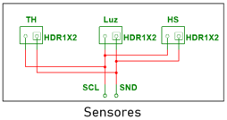

# Sistema de riego para cultivos de tomate
## I. **Objetivo**
Desarrollar e implementar un sistema de riego automatizado basado en electrónica digital que emplee sensores de humedad para determinar el nivel de riego necesario, una FPGA para el procesamiento y toma de decisiones, y actuadores como mini bombas para la distribución del agua; con la finalidad de obtener un monitoreo y control eficiente de cultivos de tomate, optimizando el uso del agua y asegurando condiciones óptimas para el crecimiento de las plantas. 
## II. **Solución**
Como solución se desarrolló un sistema de riego automatizado basado en una FPGA, que implemente el protocolo de comunicación I2C para la lectura de un sensor digital de humedad del suelo, para facilitar el monitoreo, optimización y activación en el riego de una planta de tomate por medio de una mini bomba de agua. Se integro una pantalla LCD para la visualización de datos, y luces Led indicando el funcionamiento del dispositivo.

En el desarrollo del proyecto se analizaron dos enfoques distintos como solución para la problemática planteada. En el primer enfoque se propone la automatización de un cultivo basada en una red de sensores para monitorear 3 variables distintas en tiempo real, estos datos serian procesados en la FPGA, la cual regula los actuadores necesarios para mantener las condiciones óptimas de crecimiento. En esta solución podemos ver una perspectiva más general con un control integral del ambiente dadas las variables controladas.

Por otro lado, la solución finalmente implementada se centra en la automatización del riego utilizando una FPGA con el protocolo de comunicación I2C para la lectura de un sensor digital de humedad del suelo. A diferencia del primer enfoque, este sistema está diseñado específicamente para optimizar la irrigación, teniendo como actuador una mini bomba de agua que se activa cuando se detectan niveles inadecuados de humedad en el suelo. Adicionalmente, se incorporó una pantalla LCD para la visualización de datos y luces LED como indicadores del funcionamiento del dispositivo, brindando una interfaz más accesible para el monitoreo del sistema.

En términos de comparación, la primera solución planteada ofrece un monitoreo mas amplio al incluir múltiples sensores y permitir una regulación de distintos factores dados en los entornos del cultivo, en contraste, la solución final presenta sistemas más específicos, prácticos y optimizados para el sistema de riego automatizado, esto permite una comunicación mas eficiente y confiable con la FPGA. Además, la incorporación de la interfaz visual permite un análisis y comprensión más sencillo y efectivo de la variable utilizada.

## III. **Estructura de la Solución**
a) *Sensores*

b) *Circuito*

Este circuito se planteó teniendo en cuenta los dispositivos de entrada y salida necesarios para el funcionamiento adecuado del proyecto. Estos componentes se categorizaron dependiendo de su función, y fueron ubicados en la PCB con modelos preestablecidos, o en su defecto, conectores con el mismo número de terminales. A continuación se describe cada uno de ellos. 

* Alimentación y comunicación de sensores

  
  
* Bomba de agua
  
* LEDs de salida

## IV. **Tamaño de la Solución**
## V. **Desafios**
| Semana | Fechas                  | Actividad Principal                         |
|--------|-------------------------|---------------------------------------------|
| 1      |   2/12/2024 - 6/12/2024     | Investigación y planeación de componentes |
| 2      |   9/12/2024 - 13/12/2024    | Configuración de sensores                 |
| 3      |   16/12/2024 - 20/12/2024    | Implementación de conversor ADC           |
| 4 - 5  |   13/01/2025 - 24/01/2025   | Programación y recopilación de datos en la FPGA |
| 6      |   27/01/2025 - 31/01/2025   | Configuración de actuadores               |
| 7      |   3/02/2025 - 7/02/2025     | Integración de todo el sistema y pruebas finales |
| 8      |   10/02/2025 - 14/02/2025   | Presentación del documento y proyecto final |

## VI. **Conclusiones**
* La implementación del sistema de riego permitió la una automatización eficiente del proceso, asegurando de esta forma que la planta del cultivo reciba el agua necesaria según los niveles de humedad detectados por el sensor. Cabe resaltar que la sincronización entre el sensor y actuador fueron claves para el éxito del sistema, dado que se requirieron manejos efectivos de los datos censados.
 
* La inclusión de la pantalla LCD y luces LED  mejoro la interacción con el usuario, ya que facilita la supervisión del estado del sistema, proporcionando una referencia visual sobre el funcionamiento del sistemas

## VII. **Trabajos futuros**
Como parte de los trabajos futuros en el proyecto se plantea la inclusión de más sensores ambientales que  permitan un monitoreo mas completo de las variables que repercuten en el crecimiento de la planta, se contemplan sensores como los de temperatura, luz y niveles de nutrientes.
De igual se explorará la posibilidad de mejorar la comunicación entre los sensores y la FPGA, para una mejor eficiencia en la transmisión de datos, y mayor precisión en rangos de activación de los actuadores implementados.
