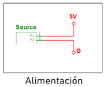
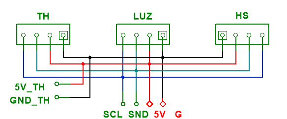
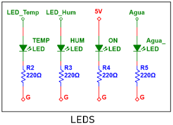
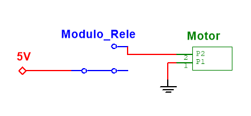
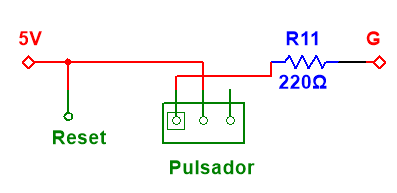
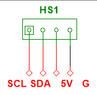

# Sistema de riego para cultivos de tomate
## I. **Objetivo**
Desarrollar e implementar un sistema de riego automatizado basado en electrónica digital que emplee un sensor de humedad para determinar el nivel de riego necesario, una FPGA para el procesamiento y toma de decisiones, y actuadores como mini bombas para la distribución del agua; con la finalidad de obtener un monitoreo y control eficiente de cultivos de tomate, optimizando el uso del agua y asegurando condiciones óptimas para el crecimiento de las plantas. 

### Objetivos: Propuesta de proyecto

- Diseñar y crear un sistema digital basado en una FPGA que ofrezca de manera autónoma los cuidados necesarios para un cultivo en zonas urbanas mediante actuadores, conforme a la información suministrada por sensores de humedad, temperatura, luz y nutrientes.
  - El objetivo se cumplió parcialmente. Se implementó el sensor de humedad de suelo para la medición del porcentaje de humedad en la tierra del cultivo. La comunicación de los datos se realiza por medio de I2C, y se procesa en la FPGA para su interpretación, y posterior visualización en una pantalla LCD. Así mismo, la información suministrada por los sensores de temperatura y luz fue leída utilizando el mismo protocolo mencionado; sin embargo, no se implementó en la versión final el código inicial para configurarlos correctamente. No hay sensor de nutrientes. 
- Utilizar lenguajes de programación de hardware como lo pueden ser VHDL/Verilog para integrar la lógica digital que va a controlar los procesos autónomos en el sistema para el cuidado del cultivo.
  - El objetivo se cumplió completamente. La programación utilizada para el correcto funcionamiento del proyecto utiliza lenguaje Verilog para:
    - Implementación de protocolo I2C y lectura de los sensores. 
    - Análisis, procesamiento y alamacenamiento de la información leída.
    - Control de los actuadores en función de los datos entregados por el sensor. 
- Diseñar algoritmos de control que minimicen el desperdicio de agua, fertilizantes, energía eléctrica, componentes, etc; para disminuir los costos de producción agraria, los costos de la implementación del sistema y agilizar procesos.
  - No se implementó ningún algoritmo mencionado en el objetivo. Sin embargo, el sistema automatizado de riego automático sí agiliza procesos en el cultivo de plantas. 
- Validar y calibrar los sensores y actuadores para garantizar mediciones precisas.
  - Sí se cumplió el objetivo. El sensor de humedad de suelo fue validado inicialmente en otro dispositivo para comprobar su funcionamiento. Posteriormente, se implementó en la FPGA, y se calibró el porcentaje de humedad percibido con el fin de controlar los actuadores en función de los datos recopilados. 
- Favorecer la versatilidad del sistema en diferentes espacios urbanos, como lo pueden ser balcones, patios, jardines, etc. 
  - Sí se cumplió el objetivo. El proyecto puede movilizarse sin mayor complejidad, lo que facilita su portabilidad y ubicación en cualquier espacio que garantice la protección contra humedad en la caja de circuitos. 
- Probar el funcionamiento del sistema con un tipo de cultivo específico que se pueda sembrar en la ciudad de Bogotá, caracterizando e implementando en el sistema las condiciones para que dicho cultivo crezca de la manera más eficiente y sana.
  - Sí se cummplió el objetivo. Este sistema de monitoreo se implementó correctamente en una planta de tomate; cuyas condiciones de cultivo se ajustan a Bogotá. 

## II. **Solución**
Como solución se desarrolló un sistema de riego automatizado basado en una FPGA, que implemente el protocolo de comunicación I2C para la lectura de un sensor digital de humedad del suelo, para facilitar el monitoreo, optimización y activación en el riego de una planta de tomate por medio de una mini bomba de agua. Se integro una pantalla LCD para la visualización de datos, y luces Led indicando el funcionamiento del dispositivo.

En el desarrollo del proyecto se analizaron dos enfoques distintos como solución para la problemática planteada. En el primer enfoque se propone la automatización de un cultivo basada en una red de sensores para monitorear 3 variables distintas en tiempo real, estos datos serian procesados en la FPGA, la cual regula los actuadores necesarios para mantener las condiciones óptimas de crecimiento. En esta solución podemos ver una perspectiva más general con un control integral del ambiente dadas las variables controladas.

Por otro lado, la solución finalmente implementada se centra en la automatización del riego utilizando una FPGA con el protocolo de comunicación I2C para la lectura de un sensor digital de humedad del suelo. A diferencia del primer enfoque, este sistema está diseñado específicamente para optimizar la irrigación, teniendo como actuador una mini bomba de agua que se activa cuando se detectan niveles inadecuados de humedad en el suelo. Adicionalmente, se incorporó una pantalla LCD para la visualización de datos y luces LED como indicadores del funcionamiento del dispositivo, brindando una interfaz más accesible para el monitoreo del sistema.

En términos de comparación, la primera solución planteada ofrece un monitoreo mas amplio al incluir múltiples sensores y permitir una regulación de distintos factores dados en los entornos del cultivo, en contraste, la solución final presenta sistemas más específicos, prácticos y optimizados para el sistema de riego automatizado, esto permite una comunicación mas eficiente y confiable con la FPGA. Además, la incorporación de la interfaz visual permite un análisis y comprensión más sencillo y efectivo de la variable utilizada.

## III. **Estructura de la Solución**
* Sensores
Para la comunicación de los sensores con la FPGA se apreció que la mejor opción era usar el protocolo I2C, pues dicho protocolo nos permite comunicar varios dispositivos esclavos (en este caso sensores) a un maestro (en este caso la FPGA) con solo dos buses, SCL (línea de reloj en serie) y SDA (línea de datos en serie), lo cual optimiza el espacio a la hora de diseñar nuestra PCB y permite que haya menos presencia de cables en nuestro diseño lo que nos facilita la implementación física del sistema.
Basándose en la lógica planteada por el manual I2C de NXP Semiconductors [2]:

Se construyó la siguiente arquitectura donde el módulo master I2C, controlador y divisor de frecuencia son implementaciones descritas en verilog que se sintetizan en la FPGA. La función de cada módulo es la siguiente :

* Módulo master I2C: Su función es incorporar la lógica planteada por el manual I2C mediante una máquina de 9 estados: IDLE, START, ADDR, READ, WRITE, ACK1, DATA, ACK2, STOP; dicha máquina nos permite implementar el bus SDA. También es la encargada de generar el bus SCL y la interacción entre este bus y el bus SDA. 

* Controlador: Su función es cambiar el valor ADDR para que el módulo I2C master lea la información de cada sensor; envía la señal START para iniciar la máquina de estados del módulo I2C master; envía la orden de si la FPGA va a escribir un valor o a leer un valor, es la que maneja los valores censados e implementa la lógica que van a seguir los actuadores y por último es la que envía el valor a escribir en dado caso que se quiera transmitir información. 

* Divisor de frecuencia: Se encarga de convertir la frecuencia del clock de la FPGA, en este caso 25 MHz, a la frecuencia de operación del protocolo I2C, que en este caso es de 100KHz para el modo estándar de velocidad de operación.

b) *Circuito*

Este circuito se planteó teniendo en cuenta los dispositivos de entrada y salida necesarios para el funcionamiento adecuado del proyecto. Estos componentes se categorizaron dependiendo de su función, y fueron ubicados en el esquemático con modelos preestablecidos, o en su defecto, conectores con el mismo número de terminales. A continuación se describe cada uno de ellos. 

* Alimentación y comunicación de sensores

  
  

  El conector "Source" es la entrada de 5V que alimenta todo el proyecto. A sus terminales están conectados todos los dispositivos que requieren una alimentación constante, como los sensores, display, la bomba de agua y la FPGA.
Por otro lado, cada sensor cuenta con dos terminales de conexión que se unen en común a las salidas SCL y SND para la comunicación de cada dispositivo de entrada con la FPGA. 

* LEDs de salida

* Bomba de agua

La bomba de agua se encuentra conectada a un módulo Relé que se activa cuando el sensor de humedad del suelo detecta un porcentaje de humedad mayor a lo establecido en el programa. Este relé conecta la minibomba a tierra. 

  
  

Cada LED se encuentra conectado a una de las salidas de la FPGA para ser activado dependiendo de su función. Los primeros dos LEDs se utilizan como medida de alerta, indicando que las variables asociadas (temperatura y humedad) no se encuentran en el rango adecuado de operación. El tercer LED se activará cuando el dispositivo esté encendido, y el cuarto indicará que la minibomba está encendida.

* Botón de Reset

La PCB cuenta un arreglo de resisetencias y un pulsador para simular un pulso de 5V en caso de que se necesite realizar un RESET en la FPGA. La siguiente figura muestra el diagrama esquemático de la conexión. 

* Pantalla LCD

En circuito esquemático se encuentra conectada la pantlla LCD con sus respectivos pines de alimentación (5V y G) y comunicación (SCL y SDA). 

    

## IV. **Desafios**
| Semana | Fechas                  | Actividad Principal                         |
|--------|-------------------------|---------------------------------------------|
| 1      |   2/12/2024 - 6/12/2024     | Investigación y planeación de componentes |
| 2      |   9/12/2024 - 13/12/2024    | Configuración de sensores                 |
| 3      |   16/12/2024 - 20/12/2024    | Implementación de conversor ADC           |
| 4 - 5  |   13/01/2025 - 24/01/2025   | Programación y recopilación de datos en la FPGA |
| 6      |   27/01/2025 - 31/01/2025   | Configuración de actuadores               |
| 7      |   3/02/2025 - 7/02/2025     | Integración de todo el sistema y pruebas finales |
| 8      |   10/02/2025 - 14/02/2025   | Presentación del documento y proyecto final |

En cuanto a las actividades de “ Investigación y planeación de componentes”, ” configuración de sensores” se tuvo un desempeño satisfactorio pues se cumplieron el 100% de los objetivos en las fechas propuestas, lo que supuso un buen comienzo. 

Por su parte las actividades de “Implementación de conversor ADC”, “Programación y recopilación de datos en la FPGA” hubieron cambios, pues en un principio se pensó en comunicar los sensores con la FPGA con conversores ADC, lo cual se descartó al ver como mejor opción para esta tarea el protocolo I2C, ese cambio más el hecho de que el protocolo I2C conllevaba una densa investigación que no estaba apreciada dentro del calendario, causó un retraso en nuestro proyecto de una semana en primer lugar.

Luego, hubo dificultades al intentar describir el comportamiento  en verilog del protocolo I2C para lograr la comunicación entre la FPGA y los sensores, lo cual supuso una semana más de atraso,  sin embargo, en la semana siguiente de trabajo se pudieron solucionar muchas dificultades y darle más claridad al diseño, dejándonos con un avance del 80% en estas dos actividades, faltandonos la prueba del código implementando ya los actuadores.

El cronograma inicial planteado en la propuesta sugiere un trabajo distribuido en 8 semanas, dónde cada elemento se ejecutaba de manera independiente y única; sin embargo, para mejorar la distribución, se llevó a cabo un trabajo en paralelo dónde la “Configuración de actuadores”, y “Programación y recopilación de datos en la FPGA” se realizó simultáneamente con tareas divididas entre los miembros del equipo de trabajo. Esta forma de organización permitió alinear el avance del proyecto con el cronograma propuesto en un principio.

La implementación de los actuadores tuvieron retraso de una semana; no obstante, gran parte de lo planeado hasta ese momento ya se encontraba realizado.

## V. **Conclusiones**
* La implementación del sistema de riego permitió la una automatización eficiente del proceso, asegurando de esta forma que la planta del cultivo reciba el agua necesaria según los niveles de humedad detectados por el sensor. Cabe resaltar que la sincronización entre el sensor y actuador fueron claves para el éxito del sistema, dado que se requirieron manejos efectivos de los datos censados.
 
* La inclusión de la pantalla LCD y luces LED  mejoro la interacción con el usuario, ya que facilita la supervisión del estado del sistema, proporcionando una referencia visual sobre el funcionamiento del sistemas

## VI. **Trabajos futuros**
Como parte de los trabajos futuros en el proyecto se plantea la inclusión de más sensores ambientales que  permitan un monitoreo mas completo de las variables que repercuten en el crecimiento de la planta, se contemplan sensores como los de temperatura, luz y niveles de nutrientes.
De igual se explorará la posibilidad de mejorar la comunicación entre los sensores y la FPGA, para una mejor eficiencia en la transmisión de datos, y mayor precisión en rangos de activación de los actuadores implementados.
